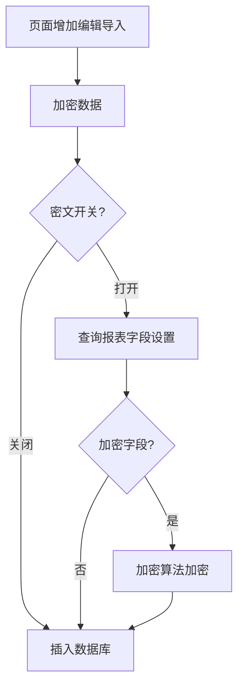
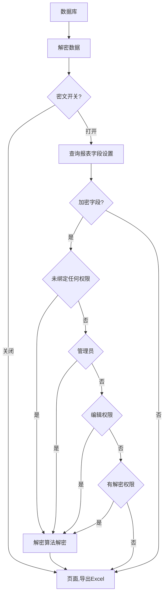

##### 数据加密遗留问题

1. 权限控制问题：系统所有导入入口没有区分权限，页面不能编辑的字段也能通过导入修改，引入加密数据后，导出后密文也可修改导致数据错误
2. 历史数据问题：报表字段设置为密文字段后，开关打开的情况下，所有更新数据库数据操作都会将字段加密，如果在加密字段插入数据库后，关闭开关或者取消加密字段标识，插入数据库的为明文，解密时明文和历史数据的密文无法区分
3. 设置繁琐：源表和结果表都需要做加密设置时，必须将源表和结果表对应字段都同时设置为加密字段，才能保证源表和结果表数据统一，否者解密会出错
4. 数据安全：由于直接对数据库原始数据进行加密，一旦数据混淆，难以恢复。
5. 字段长度问题：加密数据字段后，一般的加密方式，数据长度会变化，插入数据库需要做字段长度变更，且Number类型的数据不能改变数据类型
6. 勾稽关系：数据库存储加密字段，难以对结果表数据进行勾稽

* * *
##### 数据加密

* * *
##### 数据解密

